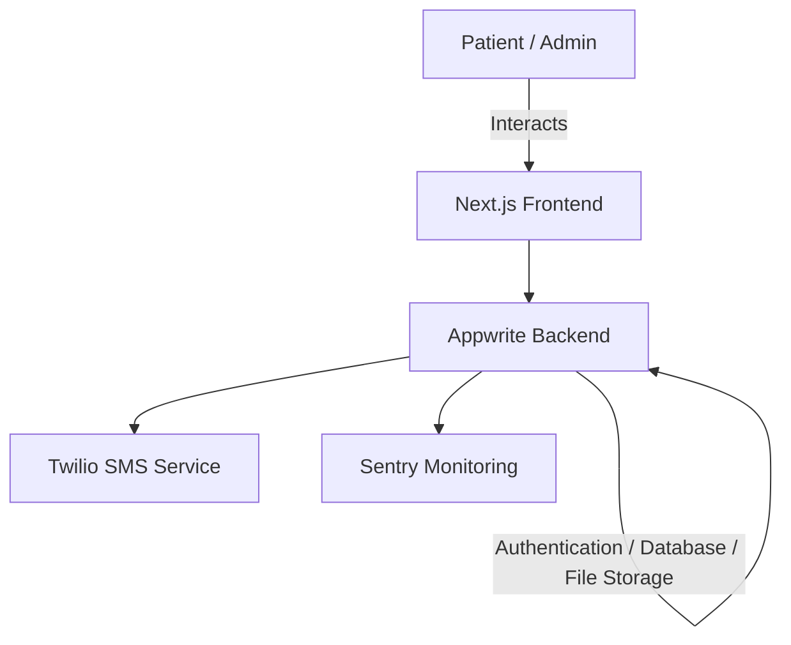

# CarePulse 🏥💙

A **Patient Management System** healthcare platform that streamlines patient registration, appointment scheduling, and medical records management. CarePulse also integrates **complex forms**, **file uploads**, and **SMS notifications** for a complete digital healthcare experience.

---

## 📋 Features

👉 **Register as a Patient** – Users can sign up and create a personal profile.
👉 **Book Appointments** – Patients can schedule one or multiple appointments with doctors.
👉 **Admin Appointment Management** – Admins can view, confirm, reschedule, or cancel appointments.
👉 **SMS Notifications** – Appointment confirmations and updates are sent via SMS using Twilio.
👉 **File Upload with Appwrite Storage** – Patients can securely upload and store files.
👉 **Full Responsiveness** – Works smoothly across all devices and screen sizes.
👉 **Performance Monitoring** – Integrated with Sentry to track application performance and errors.
👉 **Code Reusability & Architecture** – Built with a modular and scalable structure.

---

## 🛠 Tech Stack

* **Frontend:** Next.js, TypeScript, TailwindCSS, ShadCN
* **Backend & Services:** Appwrite (Auth, Database, File Storage)
* **Notifications:** Twilio (SMS Integration)
* **Monitoring:** Sentry

---

## 🏗️ System Architecture



---

## 📂 Folder Structure

```
CarePulse/
│── src/
│   ├── app/             # Next.js app routes & pages
│   ├── components/      # Reusable UI components
│   ├── lib/             # Utility functions & config
│   ├── styles/          # Global styles (Tailwind)
│   └── hooks/           # Custom React hooks
│
│── public/              # Static assets & favicon
│── .env.local           # Environment variables (Appwrite, Twilio, etc.)
│── README.md            # Project documentation
```

---

## 🚀 Getting Started

1️⃣ Clone the repo:

```bash
git clone https://github.com/your-username/carepulse.git
cd carepulse
```

2️⃣ Install dependencies:

```bash
npm install
```

3️⃣ Set up environment variables in `.env.local`:

```env
NEXT_PUBLIC_APPWRITE_ENDPOINT=your_appwrite_endpoint
NEXT_PUBLIC_APPWRITE_PROJECT=your_project_id
TWILIO_ACCOUNT_SID=your_twilio_sid
TWILIO_AUTH_TOKEN=your_twilio_token
TWILIO_PHONE_NUMBER=your_twilio_number
```

4️⃣ Run the development server:

```bash
npm run dev
```

---

## 📱 Screenshots

(Add some UI previews here – login page, appointment booking, admin panel)

---

## 🤝 Contributing

Contributions are welcome! Feel free to open issues and submit PRs.

---

## 📜 License

This project is licensed under the **MIT License**.

---

## 🙌 Acknowledgements

* [Next.js](https://nextjs.org/)
* [Appwrite](https://appwrite.io/)
* [Twilio](https://www.twilio.com/)
* [Sentry](https://sentry.io/)
* [ShadCN](https://ui.shadcn.com/)
